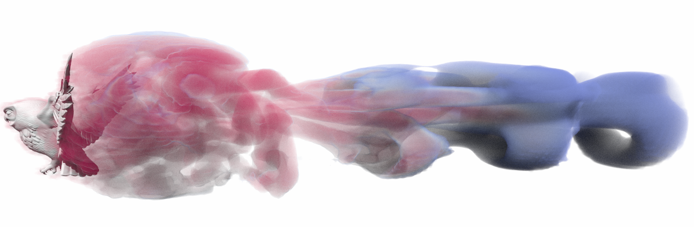

# Advanced Real-Time Volume Graphics

This is the code repository for the Advanced Real-Time Volume Graphics
[course presented at SIGGRAPH 2026](https://doi.org/10.1145/3799820.3812500).
The course discusses how to write modern volume renderers that are targeted at
sci-vis:

- The framework adopts a Monte Carlo approach.
- Data values are mapped to color and opacity using an RGBA transfer function.
- The data is expected to be large, potentially distributed across compute
  nodes.
- Data items have non-trivial formats, e.g., tetrahedra, sparse voxels, etc.
- The data is inhomogeneous and adaptive sampling and space leaping techniques
  are paramount.
- Inhomogeneity also comes from the transfer function. An important goal is to
  be able to adjust the transfer function interactively during exploration and
  acceleration structures must adapt to that interactively.

Attendees of the course will learn how to develop a modern volume renderer from
scratch that makes use of interactive ray tracing and can, in its final form,
even be loaded as a plugin into VTK and ParaView. Hardware-accelerated ray
tracing is at the core of this framework. We exemplify this using NVIDIA
hardware, but also provide fallbacks as hardware ray tracing is often not
available on HPC systems that are used for sci-vis. The core abstractions we
use for interactive ray tracing are [OptiX and
OWL](https://doi.org/10.1145/3799820.3812489).

## Real-time and interactive
Our course is meant as a prequel to the [Real-Time Volume Graphics
course](https://doi.org/10.1145/1103900.1103929) at SIGGRAPH'04, which was
presented more than 20 years ago. This course focused on interactive volume
rendering techniques during the advent of GPUs in general. Much has changed in
the meantime. We advocate a Monte Carlo approach to volume graphics in sci-vis
because it simplifies a lot of things, including handling of multiple volumes,
building space skipping structures, or seamless interoperability with surface
rendering. The cost for that is variance and noise in the output. Our renderers
(except for the ones presented in the first two examples) will produce
_convergence_ frames in real-time, but there will be noise. How to address that
is beyond the scope of this course; in that sense, the renderers focus on
interactivity more than on producing fully converged frames in real-time.  It
is expected that the user will take measures such as denoising convergence
frames, but we don't focus on these techniques in our course.

## Sample code organization
The course is centered around ten example programs demonstrating volume
rendering techniques. Each sample is organized into a host and device code part
(even when rendering on the CPU), where the file `hostCode.cpp` contains the
implementation for data wrangling, setting up acceleration structures,
initiating frame rendering, etc.; and the file `deviceCode.cu` implements the
GPU (or CPU-device) renderer. The framework is performance portable. Later
examples make use of specific GPU features including hardware ray tracing; some
of the features and examples only work on NVIDIA GPUs with RTX ray tracing
cores. We provide CPU fallbacks for most of the examples (see below for
details).

## Example programs overview

### Ex. 00: Hello DVR Course!
### Ex. 01: Let there be voxels..
### Ex. 02: Woodcock tracking
### Ex. 03: Multi volume
### Ex. 04: Lights on!!
### Ex. 05: Tets N' friends
### Ex. 06: Need for Speed
### Ex. 07: Render Graph
### Ex. 08 (TODO: on multi-GPU)
### Ex. 09: ANARI
